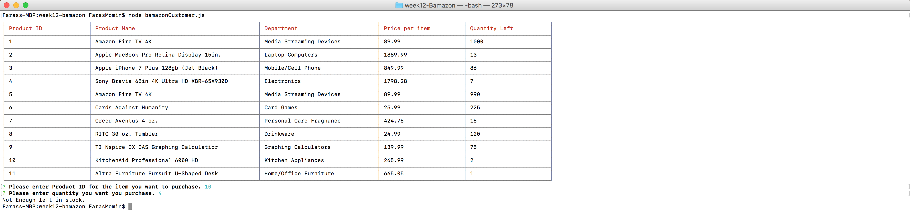

# week12-Bamazon
This app shows list of products available on Bamazon, then it will ask buyer what product they would like to purchase and how many. Then the app will check if the product is available, and if enough quantity is available to complete the purchase.

## Screenshots

User1 is trying to buy 4 Apple Macbook Pro (Product ID: 2). Bamazon has 17 Apple Macbook Pro in stock.

After user 1 bought 4 Apple Macbook Pro, the quantity left has dropped to 13. User2 is looking to purchase 3 KitchenAid Professional 6000 HD (Product ID: 10), but bamazon only has 2 left in stock. App denies this purchase to user 2, with message "not enough left in stock"

##Video
https://drive.google.com/a/utexas.edu/file/d/0B3GzLu0czsRvaGFCa1dRamh4bkE/view?usp=sharing
