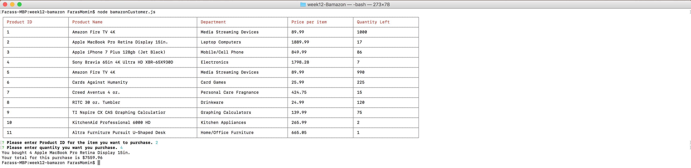

# week12-Bamazon

## Screenshots

User1 is trying to buy 4 Apple Macbook Pro (Product ID: 2). Bamazon has 17 Apple Macbook Pro in stock.

After user 1 bought 4 Apple Macbook Pro, the quantity left has dropped to 13. User2 is looking to purchase 3 KitchenAid Professional 6000 HD (Product ID: 10), but bamazon only has 2 left in stock. App denies this purchase to user 2, with message "not enough left in stock"

##Video
 
